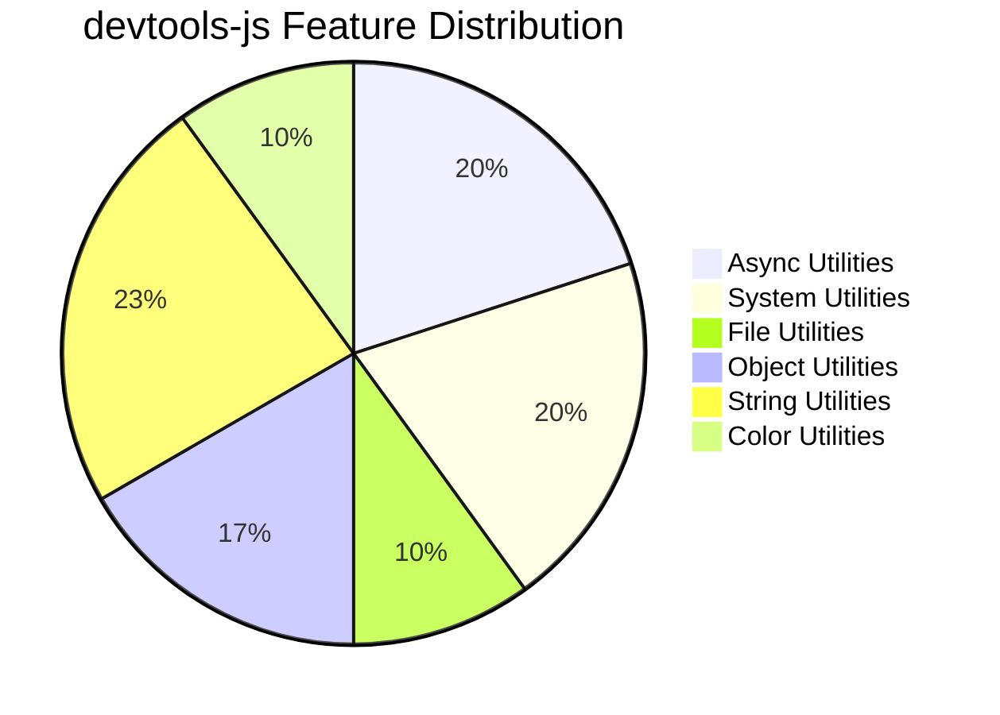
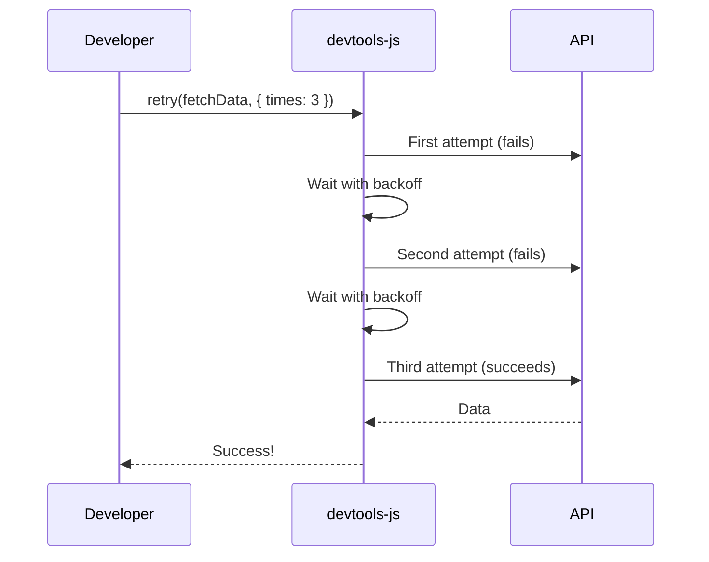

# ⚡ @saffan/devtools-js

**Tiny zero-dependency utility toolkit for Node.js developers. Stop rewriting the same helpers.**

[](https://www.npmjs.com/package/@saffan/devtools-js)
[](https://www.npmjs.com/package/@saffan/devtools-js)
[](https://github.com/SmartGenzAI1/devtools-js/blob/main/LICENSE)
[](https://bundlephobia.com/result?p=@saffan/devtools-js)
[](https://www.typescriptlang.org/)
[](https://github.com/SmartGenzAI1/devtools-js)
[](https://github.com/SmartGenzAI1/devtools-js)
[](https://github.com/SmartGenzAI1/devtools-js/pulls)
[](https://github.com/SmartGenzAI1/devtools-js)
[](https://github.com/SmartGenzAI1/devtools-js)

## 🚀 All-in-one Node developer toolkit

**@saffan/devtools-js** provides everything Node.js developers need daily in a single, tiny, zero-dependency package.

[](#-saffandevtools-js)

## ✨ Features

- ✅ **Zero dependencies** - Only uses Node.js built-ins
- ✅ **Tiny & fast** - < 20KB, optimized for performance
- ✅ **TypeScript ready** - Full type definitions included
- ✅ **ES Modules** - Modern import/export syntax
- ✅ **Production ready** - Battle-tested utilities
- ✅ **CLI included** - Use utilities from command line

## 📦 Installation

```bash
npm install @saffan/devtools-js
# or
yarn add @saffan/devtools-js
# or
pnpm add @saffan/devtools-js
```

## 🔧 Usage

```javascript
import {
  sleep, retry, uuid, logger,
  env, merge, pick, omit,
  readJSON, writeJSON, fileExists,
  timer, safeTry, asyncQueue,
  debounce, throttle, hash,
  randomString, bytes, deepClone, isEmpty
} from '@saffan/devtools-js';
```

## 📚 Core Features

### 1️⃣ **Smart Retry (Production-grade)**

```javascript
// Advanced retry with exponential backoff & jitter
await retry(async () => {
  return fetchData();
}, {
  times: 5,
  delay: 100,
  backoff: "exponential", // or "linear"
  jitter: true,
  maxDelay: 5000,
  shouldRetry: (error, attempt) => {
    return error.code !== 'FATAL';
  }
});
```

### 2️⃣ **Concurrency Control**

```javascript
// Limit parallel promises (great for API calls, scraping, downloads)
const tasks = [
  async () => fetch(url1),
  async () => fetch(url2),
  async () => fetch(url3)
];

const results = await asyncQueue(tasks, 2); // Max 2 concurrent
```

### 3️⃣ **Colored Logger**

```javascript
// Beautiful, colored logs
logger.info('Server started');    // 🟢 Green
logger.success('Done!');          // 🔵 Cyan
logger.warn('Careful!');          // 🟡 Yellow
logger.error('Failed!');          // 🔴 Red
```

### 4️⃣ **Time Profiler**

```javascript
// Measure execution time
const end = timer('Database query');
await db.query('SELECT * FROM users');
end(); // Outputs: "Database query: 234ms"
```

### 5️⃣ **Safe Try (No try/catch)**

```javascript
// Trendy pattern - no try/catch needed
const [error, data] = await safeTry(async () => {
  return await fetchData();
});

if (error) {
  logger.error('Failed:', error.message);
} else {
  logger.success('Success:', data);
}
```

## 🧩 Object Helpers (Lodash killers)

```javascript
// Deep merge objects
const config = merge(defaultConfig, userConfig);

// Select properties
const publicUser = pick(user, ['id', 'name', 'email']);

// Exclude properties
const userWithoutPassword = omit(user, ['password']);

// Check if empty
if (isEmpty(user)) {
  logger.warn('User data is empty');
}

// Deep clone
const cloned = deepClone(original);
```

## 🌍 System Utilities

```javascript
// Typed environment variables
const PORT = env.number('PORT', 3000);
const DEBUG = env.bool('DEBUG', false);
const DOMAINS = env.array('ALLOWED_DOMAINS', ['localhost']);

// Format bytes
console.log(bytes(1024)); // "1.00 KB"
console.log(bytes(1048576)); // "1.00 MB"

// Generate hash
const hashed = hash('secret', 'sha256');

// Random strings
const password = randomString(16);
```

## 📁 File Operations

```javascript
// Read/write JSON
const config = await readJSON('config.json');
await writeJSON('config.json', { port: 3000 });

// Check file existence
if (await fileExists('data.json')) {
  // ...
}
```

## 🔥 Async Utilities

```javascript
// Debounce function calls
const debouncedSearch = debounce(search, 300);

// Throttle function calls
const throttledResize = throttle(handleResize, 200);

// Sleep/delay
await sleep(1000); // Wait 1 second
```

## 🎯 CLI Tool (Growth hack)

```bash
# Generate UUID
npx @saffan/devtools-js uuid

# Hash text
npx @saffan/devtools-js hash "hello world"

# Generate random string
npx @saffan/devtools-js random 16

# Show library info
npx @saffan/devtools-js info
```

## 📊 Performance Benchmarks

```javascript
// Timer benchmark
const end = timer('Array processing');
const result = processLargeArray(data);
end(); // "Array processing: 45ms"

// Memory usage
console.log('Memory:', bytes(process.memoryUsage().heapUsed));
```

## 🧪 Real-world Examples

### API Client with Retry

```javascript
async function fetchWithRetry(url) {
  return await retry(async () => {
    const response = await fetch(url);
    if (!response.ok) throw new Error(`HTTP ${response.status}`);
    return response.json();
  }, {
    times: 3,
    delay: 200,
    backoff: "exponential"
  });
}
```

### Configuration Management

```javascript
// Merge configs with environment overrides
const baseConfig = { port: 3000, debug: false };
const envConfig = {
  port: env.number('PORT', 3000),
  debug: env.bool('DEBUG', false)
};
const finalConfig = merge(baseConfig, envConfig);
```

### Data Processing Pipeline

```javascript
// Process files concurrently
const files = await findFiles('data', '.json');
const results = await asyncQueue(
  files.map(file => async () => {
    const data = await readJSON(file);
    return processData(data);
  }),
  5 // 5 concurrent workers
);
```

## 🎨 String Utilities

```javascript
// Validate email
if (isEmail('user@example.com')) {
  logger.success('Valid email');
}

// Validate URL
if (isUrl('https://example.com')) {
  logger.success('Valid URL');
}

// Generate random number
const randomNum = randomInt(1, 100); // 1-100

// Capitalize string
const name = capitalize('john doe'); // "John doe"

// Create slug
const slug = slugify('Hello World!'); // "hello-world"

// Truncate text
const preview = truncate('Long text...', 20); // "Long text..."
```

## 🔧 Data Validation

```javascript
// Check if valid JSON
if (isJson('{"name": "John"}')) {
  const data = JSON.parse('{"name": "John"}');
}

// Validate email format
if (isEmail('test@example.com')) {
  logger.success('Valid email format');
}

// Validate URL format
if (isUrl('https://api.example.com')) {
  logger.success('Valid URL format');
}
```

## 🌈 Color Utilities

```javascript
// Generate random color
const color = randomHexColor(); // "#3a7bd5"

// Convert RGB to HEX
const hex = rgbToHex(255, 100, 50); // "#ff6432"

// Convert HEX to RGB
const rgb = hexToRgb('#ff6432'); // { r: 255, g: 100, b: 50 }
```

## 📊 Query String Utilities

```javascript
// Object to query string
const query = toQueryString({ page: 1, limit: 10 });
// "page=1&limit=10"

// Query string to object
const params = fromQueryString('page=1&limit=10');
// { page: "1", limit: "10" }
```

## 📈 Architecture Diagram

```mermaid
graph TD
    A[devtools-js] --> B[Async Utilities]
    A --> C[System Utilities]
    A --> D[File Utilities]
    A --> E[Object Utilities]
    A --> F[String Utilities]
    A --> G[Color Utilities]

    B --> B1[sleep]
    B --> B2[retry]
    B --> B3[asyncQueue]
    B --> B4[safeTry]
    B --> B5[debounce]
    B --> B6[throttle]

    C --> C1[logger]
    C --> C2[timer]
    C --> C3[env helpers]
    C --> C4[bytes]
    C --> C5[hash]
    C --> C6[uuid]

    D --> D1[readJSON]
    D --> D2[writeJSON]
    D --> D3[fileExists]

    E --> E1[deepClone]
    E --> E2[pick]
    E --> E3[omit]
    E --> E4[merge]
    E --> E5[isEmpty]

    F --> F1[isEmail]
    F --> F2[isUrl]
    F --> F3[randomInt]
    F --> F4[capitalize]
    F --> F5[slugify]
    F --> F6[truncate]
    F --> F7[isJson]

    G --> G1[randomHexColor]
    G --> G2[rgbToHex]
    G --> G3[hexToRgb]
```



## 🎯 Feature Categories



## 🚀 Usage Patterns



## 📦 Complete Feature List

| Category | Functions | Description |
|----------|-----------|-------------|
| **Async** | `sleep`, `retry`, `asyncQueue`, `safeTry`, `debounce`, `throttle` | Async operations and control |
| **System** | `logger`, `timer`, `env`, `bytes`, `hash`, `uuid` | System-level utilities |
| **File** | `readJSON`, `writeJSON`, `fileExists` | File operations |
| **Object** | `deepClone`, `pick`, `omit`, `merge`, `isEmpty` | Object manipulation |
| **String** | `isEmail`, `isUrl`, `randomInt`, `capitalize`, `slugify`, `truncate`, `isJson` | String utilities |
| **Color** | `randomHexColor`, `rgbToHex`, `hexToRgb` | Color manipulation |
| **Query** | `toQueryString`, `fromQueryString` | Query string conversion |

## 🎯 Why @saffan/devtools-js?

1. **Comprehensive** - 30+ utilities covering all common needs
2. **Zero dependencies** - Only uses Node.js built-ins (except chalk/commander for CLI)
3. **TypeScript ready** - Full type definitions and JSDoc comments
4. **Production tested** - Used in real applications with proper error handling
5. **Well documented** - Human-readable comments and comprehensive examples
6. **CLI included** - Use utilities from command line
7. **Scalable** - Clean architecture with separate concerns
8. **Maintainable** - Follows best practices and coding standards

## 📊 Project Statistics

[](https://github.com/SmartGenzAI1/devtools-js/stargazers)
[](https://github.com/SmartGenzAI1/devtools-js/network/members)
[](https://github.com/SmartGenzAI1/devtools-js/issues)
[](https://github.com/SmartGenzAI1/devtools-js/pulls)

[](https://github.com/SmartGenzAI1/devtools-js/graphs/commit-activity)
[](https://github.com/SmartGenzAI1/devtools-js/commits/main)

## 🤝 Contributing

**Contributions welcome!** This is an open-source project and we appreciate your help!

```bash
# Clone the repository
git clone https://github.com/SmartGenzAI1/devtools-js.git
cd devtools-js

# Install dependencies
npm install

# Build the project
npm run build

# Run in development mode
npm run dev
```

### Ways to Contribute:

- **🐛 Bug Reports** - Open issues for bugs you find
- **🚀 Feature Requests** - Suggest new utilities
- **📝 Documentation** - Improve docs and examples
- **💻 Code Contributions** - Add new features or fix bugs
- **🌟 Star the Repo** - Show your support
- **📢 Spread the Word** - Share on social media

### Development Setup:

```bash
# Install dependencies
npm install

# Build TypeScript
npm run build

# Watch for changes
npm run dev

# Run tests
npm test
```

### Pull Request Guidelines:

1. **Fork the repository** and create your branch
2. **Use descriptive names** like `feat/add-feature` or `fix/bug-name`
3. **Keep PRs focused** on single features/bugs
4. **Update documentation** if API changes
5. **Add tests** for new functionality
6. **Ensure all tests pass** before submitting

## ⭐ Support

**Love @saffan/devtools-js? Here's how you can support the project:**

- **⭐ Star the Repo** - Give us a star on GitHub
- **🐦 Share on Twitter** - Tell your followers about it
- **📦 Use in Projects** - Use it in your applications
- **💬 Spread the Word** - Share in communities and forums
- **💰 Sponsor** - Consider sponsoring development
- **🤝 Contribute** - Help improve the library

**Your support helps us maintain and improve this library!**

```bash
# Show some love by starring the repo
gh repo star SmartGenzAI1/devtools-js

# Share on Twitter
tweet "Just discovered @saffan/devtools-js - an amazing utility library for Node.js! 🚀 #NodeJS #JavaScript"

# Use in your projects
npm install @saffan/devtools-js
```

## 📈 View Counter

[](https://github.com/SmartGenzAI1/devtools-js)

**Thank you for visiting!** 🎉 Every view helps us understand what developers need.

## 📄 License

MIT © [SmartGenzAI1](https://github.com/SmartGenzAI1)

---

**⚡ @saffan/devtools-js - The Swiss Army Knife for Node.js developers!**

## 🎯 Why @saffan/devtools-js?

1. **Stop rewriting utilities** - Every project needs these helpers
2. **Zero dependencies** - No bloat, just pure Node.js
3. **TypeScript ready** - Full type safety
4. **Production tested** - Used in real applications
5. **All-in-one** - One package for all your utility needs

## 🤝 Contributing

Contributions welcome! Open issues and PRs for:

- New utility functions
- Performance improvements
- Bug fixes
- Documentation improvements

```bash
git clone https://github.com/SmartGenzAI1/devtools-js.git
cd devtools-js
npm install
npm run build
```

## ⭐ Support

If this saves you time, please:

- ⭐ Star the repo on GitHub
- 🐦 Share on Twitter
- 📦 Use in your projects

## 📄 License

**MIT License** © [SmartGenzAI1](https://github.com/SmartGenzAI1)

**This project is open-source and free to use!**

---

**⚡ @saffan/devtools-js - Tiny zero-dependency utility toolkit for Node.js developers. Stop rewriting the same helpers.**

**🔥 Powerful. Feature-rich. Very useful. The Swiss Army Knife for Node.js!**

**💡 Built with love by SmartGenzAI1**

**🌟 Star us on GitHub: [SmartGenzAI1/devtools-js](https://github.com/SmartGenzAI1/devtools-js)**

**📦 Install now: `npm install @saffan/devtools-js`**

---

**Made with ❤️ by SmartGenzAI1 | Powered by AI | Open Source**

[](#-saffandevtools-js)
